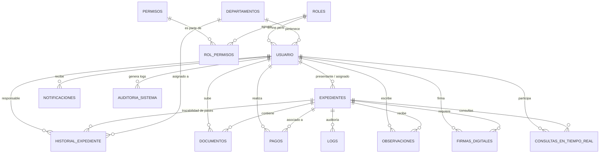

# Diagrama Entidad-Relación (ERD) - SIGEDEX

Este documento contiene la representación visual y técnica del modelo de datos actual del Sistema de Gestión de Expedientes (SIGEDEX), basado en el esquema real de la base de datos.

## Diagrama Visual (Mermaid)

## Explicación por Niveles

### 1. Capa de Definiciones (Nivel Superior)
*   **DEPARTAMENTOS:** Define las áreas físicas/lógicas de la DPA (Administración, Legal, etc.).
*   **ROLES & PERMISOS:** Sistema RBAC (Role-Based Access Control) que utiliza la tabla intermedia `ROL_PERMISOS` para una gestión granular de accesos.

### 2. Capa de Operación (Nivel Central)
*   **USUARIO:** Gestiona los datos de acceso, personales y el vínculo con el departamento/rol.
*   **EXPEDIENTES:** El objeto central del sistema. Contiene el estado actual, prioridad y metadatos de gestión.

### 3. Capa de Soporte y Traza (Nivel Inferior)
*   **HISTORIAL_EXPEDIENTE:** Registra cada "Pase" o cambio de estado, identificando al responsable y el departamento.
*   **DOCUMENTOS:** Archivos PDF/Imágenes asociados a cada expediente.
*   **PAGOS:** Registro de transacciones (Mercado Pago u otros métodos) para la formalización del trámite.
*   **FIRMAS_DIGITALES:** Almacena los hashes y métodos de firma para garantizar la validez legal.
*   **AUDITORÍA (Logs/Auditoría Sistema):** Registro técnico de acciones para seguridad e integridad del sistema.

---
*Documentación generada automáticamente basada en el dump SQL del 20/11/2025.*
